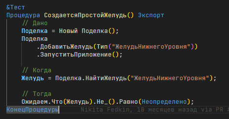

# Руководство осеннего контрибьютера

## Введение

Здравствуй, если ты здесь, значит осень захватила тебя, и ты решил превратить нашу еще пока сырую осень, в замечательную золотую осень.
Впереди долгий путь, и тебе нужно быть сильным и смлым. А это руководство поможет тебе.

## Настройка окружения

* Необходимо установить oscript и ovm - последних версий. Осень - инновационный продукт, и использует все новые возможности языка. Потому для корректной работы, необходима последнияя версия oscript.

* Установи Git

* Желательно, но не обязательно поставить Visual studio code c расширениями 1C (BSL) Extension Pack.

## Перед тем как приступить

* Сделай форк этого репозитория себе.

* Склонируй свою версию репозитория к себе в рабочее окружение.

```cmd
git clone <http://github.com/ссылкаНаТвойРепозиторий>
```

* Перейди в созданную папку и создай ветку в которой ты будешь делать свои доработки

```cmd
git checkout -b <ИмяТвоейВетки>
```

## Инициализация зависимостей

* Для корректной работы и проверки необходимо инициализировать зависимости.

```cmd
Opm install -l --dev
```

Для целей разработки используются версии пакетов которые установятся в папку `oscript_modules`

* Можете проверить что все равботает запустив тесты

```cmd
Oscript tasks/test.os
```

Если все прошло гладко, вы получите мини отчет, что то в этом духе


## Настройка отладки
Как известно, нормальному программисту отладка не нужна, отлаживай через вызватьИсключение. Потому тут ничего написано не будет.

(На самом деле, я посыпаю голову пеплом, но я не умею включать отладку в оскрипте. Напишите пожалуйста этот пункт за меня, я тоже с радостью им воспользуюсь)

Все, все приготовления сделаны! можно приступать к написанию осеннего кода.

## Начни с тестов

Если ты делаешь новый функционал, то его надо будет как-то проверить, а заодно, было бы здорово, чтобы любой другой мог проверить потом, что не разломал твой код после очередного обновления.

На данный момент существует несколько основных наборов тестов наборов тестов.

* [Базовый набор](../tests/Поделка.os) Зесь размещается основной набор тестов базовой функциональности осени
* [Тесты функционала внешнего приложения](../tests/ВнешнееПриложение.os) здесь собираются тесты связанные с заготовками и тд.
* [Тесты производительности приложения](../perfomance_tests/Производительность.os) здесь собираются svt-тесты

Выбери куда должны быть добавлены твои тесты и опиши их примерно так:


## Разработка

Если ты дошел до этого пункта - вряд-ли тебе нужны какие-то советы по разработке.
 

## Перед тем как завершить

1. Прогони тесты, падающих быть не дожно. Если ты меняешь функционал так, что тесты и не должны работать - откорректируй их. В этом случае обязательно оставь в ПР комментарий, почему тесты которые ты правишь - больше не актуальны.
2. Если ты добавил новую фичу - опиши ее в документации. Неописаная фича - работа в стол, вероятность что ей будут активно пользоваться очень мала.
3. перед отправкой изменений - обязательно проверь, что ничего лишнего не попало в репозиторий.
В удаленном репозитории не должно быть папки `oscript_modules` и `out`, не должно быть никаких лишних, не относящихся к твоей фиче файлов

## Создай Pull-request

Все, новая фича готова чтобы показать ее миру! Самое время создать ПР и поделиться ей с сообществом.